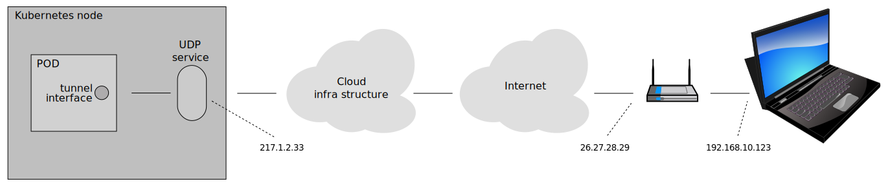

# k8s-service-tunnel

A tunnel from an external machine to a POD or node in K8s.



The intended usage is testing with multiple networks in K8s. For
instance, in telco multiple networks are common but a test cluster
with additional networks may be hard to come by. To use tunnels allows
additional networks at no cost. However, to setup tunnels requires
privileges.

The tunnel is setup via a UDP service. VXLAN tunnels are used that can
carry both IPv4 and IPv6 packets, so even if the connectivity to the
cluster is IPv4-only (your UDP service is IPv4 single-stack) you can
still test IPv6 over the tunnel.

An image and a [script](image/service-tunnel.sh) is provided for easy testing.

## The catch

When a tunnel is setup via a K8s service the external machine *must
initiate the communication* to setup the load-balancing session. If
the POD uses the tunnel before the connection via the service is
setup, it will send packets masqueraded to the node IP (at least for
the most common IPv4 setup). This will not work, but will also create
conntrack entries that make a later setup via the service impossible
(until conntrack is cleared).  This complicates the setup.

The ports must also be defined in both directions which limits the
number of usable tunnels types. On Linux both source and destination
ports can be specified for `vxlan`. I don't know how it works on other
OSes.


## Test in public cloud

Describes howto setup a service tunnel on a public cloud from your
home computer.

This has been tested with Microsoft
[Azure Kubernetes Service](https://azure.microsoft.com/en-us/products/kubernetes-service/)
(AKS).

Your home computer is probably NAT'ed if you use IPv4, so you must
find you "real" address to set the remote address for the tunnel in
the POD.

```
# On your home computer
myip=$(curl -sq https://api.myip.com | jq -r .ip)  # Get your real IP
echo $myip
```

Use this addres as TUNNEL_PEER and deploy the service and POD.
```
sed -e "s,__TUNNEL_PEER__,$myip," < service-tunnel.yaml > /tmp/service-tunnel.yaml
kubectl apply -f /tmp/service-tunnel.yaml
```

After some time the coud provider will assign a public
loadBalancerIP. This shall be used as remote address for the local
tunnel setup.

```
kubectl get svc vxlan-tunnel    # Get the external IP
remote=<external ip from above>
sudo ./image/service-tunnel.sh vxlan --peer=$remote
sudo ip link set up dev vxlan0       # Now UDP packets are sent to the service!
sudo ip addr add 10.30.30.2/30 dev vxlan0
sudo ip -6 addr add fd00:3030::2/126 dev vxlan0
```

Setup is ready. Test connectivity:
```
ping 10.30.30.1
ping fd00:3030::1
```

Clean-up:
```
kubectl delete -f /tmp/service-tunnel.yaml
sudo ip link del vxlan0
```


## Test with KinD

In [KinD](https://kind.sigs.k8s.io/) we have no NAT-box but you must
get the loadBalancerIP assigned and reachable. The KinD docs describes
[how to use metallb](https://kind.sigs.k8s.io/docs/user/loadbalancer/).
How to start KinD and assign the loadBalancerIP is out of scope for
this document.

The local address on the kind-net is what the POD must use as "remote"
address for the tunnel. This is configured in
[service-tunnel.yaml](service-tunnel.yaml). Replace the `__TUNNEL_PEER__`
string with the local address and deploy:

```
# Your host address on the kind-network (your setup may differ);
hostip=$(docker inspect kind-control-plane | jq -r '.[].NetworkSettings.Networks.kind.Gateway')
sed -e "s,__TUNNEL_PEER__,$hostip," < service-tunnel.yaml > /tmp/service-tunnel.yaml
kubectl apply -f /tmp/service-tunnel.yaml
```

Setup the tunnel interface on your computer using the script and
assign addresses:
```
kubectl get svc vxlan-tunnel    # Get the external IP
remote=<external ip from above>
sudo ./image/service-tunnel.sh vxlan --peer=$remote
sudo ip link set up dev vxlan0       # Now UDP packets are sent to the service!
sudo ip addr add 10.30.30.2/30 dev vxlan0
sudo ip -6 addr add fd00:3030::2/126 dev vxlan0
```

Setup is ready. Test connectivity:
```
ping 10.30.30.1
ping fd00:3030::1
```

Clean-up:
```
kind delete cluster
sudo ip link del vxlan0
```


## How it works

This describes how to setup a tunnel manually.

A UDP sevice is defined.

```yaml
apiVersion: v1
kind: Service
metadata:
  name: vxlan-tunnel
spec:
  selector:
    app: service-tunnel
  externalTrafficPolicy: Local
  ports:
  - port: 5533
    name: vxlan
    protocol: UDP
  type: LoadBalancer
```

The service has `externalTrafficPolicy: Local` so the tunnel in the
POD can be setup with the correct (un-NAT'ed) remote address. A POD is
started and waits for incoming UDP packets on port 5533.

Now we go to the external machine, e.g. your home computer.  The
load-balancer IP assigned to the service should be used as remote
address.

(use "sudo" when appropriate)
```
kubectl get svc vxlan-tunnel    # Get the external IP
remote=<external ip from above>
ip link add vxlan0 type vxlan id 333 dev wlp2s0 remote $remote dstport 5533 srcport 5533 5534
ip link set up dev vxlan0       # Now UDP packets are sent to the service!
ip addr add 10.30.30.2/30 dev vxlan0
ip -6 addr add fd00:3030::2/126 dev vxlan0
```

When a UDP packet is received in the POD we assume that the
load-balancing via the service is setup and a vxlan tunnel device can
be created.  Your home computer is probably NAT'ed if you use IPv4, so
you must find you "real" address to set the remote address in the POD.

```
# On your home computer
myip=$(curl -sq https://api.myip.com | jq -r .ip)  # Get your real IP
echo $myip
# In the POD
remote=<take from $myip above>
ip link add vxlan0 type vxlan id 333 dev eth0 remote $remote dstport 5533 srcport 5533 5534
ip addr add 10.30.30.1/30 dev vxlan0
ip -6 addr add fd00:3030::1/126 dev vxlan0
```

Test the connection.
```
# On your home computer
ping 10.30.30.1
ping fd00:3030::1
```


## Build the image

```
cd image
tag=your-repo.experimental.com/service-tunnel:latest
docker build -t $tag .
docker push $tag
```


